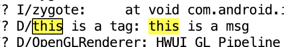
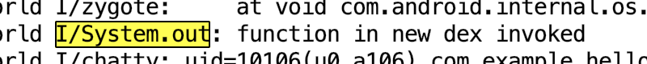
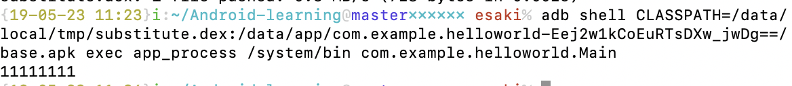

# Android-learning
## Solution to Dalvik byteCode tutorial
# 1. 通过反射修改private成员

## 1.1【实验】反射获取`haha`,修改haha的值

```Java
package test;

import java.lang.reflect.Field;

class Foo {
    private int haha = 3;
    int getField() {
        return haha;
    }
}

public class Main {
    public static void main(String[] args) throws NoSuchFieldException, IllegalAccessException {
        // notice the difference between getDeclaredField and getField
        Field privateIntField = Foo.class.getDeclaredField("haha");
        privateIntField.setAccessible(true);

        Foo fooObj = new Foo();
        privateIntField.set(fooObj, 2);
        System.out.println("fieldValue = " + privateIntField.get(fooObj));
    }
}
```

# 2. 熟练APK重签名
* https://developer.android.com/studio/command-line/apksigner
* 了解APK签名结构 https://www.jianshu.com/p/a27783a713f2

## 2.1【实验】实现一个python脚本，能够给apk重签名（先取出原有签名，再用自己的密钥重新签名）
详见mySmali & myBaksmali 文件

**myBaksmali**: 将给定的apk反编译为smali文件，用vscode打开

**mySmali**: 将上一步修改过的smali文件打包成apk，重签名，生成新apk

`./myBaksmali [xx/xx/input.apk]`

反编译apk，在打开的vscode中修改smali文件

`./mySmali [xx/xx/input.apk]`

修改好smali文件后使用生成可以安装的apk

# 3. 使用smali/baksmali查看Dalvik字节码
https://github.com/JesusFreke/smali
[这是smali源码的简明教程](https://www.52pojie.cn/thread-395689-1-1.html)

## 3.1【实验】下载去哪儿apk，baksmali之后看看源码，尝试读一读

# 4. 熟练使用jadx
* https://github.com/skylot/jadx/
* 使用反编译模式看逻辑，使用fallback模式（文件->设置）看字节码
  
## 4.1【实验】使用jadx，反编译去哪儿apk，先读java源码,再读一读对应的字节码

# 5. 修改一条invoke-xxx 指令，为onCreate通过smali增加一段Log.d的调用
例如将 `android.util.Log`的调用改掉，smali重新打包，安装，看效果

## 5.1【实验】自己写一个简单的androidapp，就实现helloworld，然后反编译修改invoke，看看效果。
在原有的smali上添加代码，调用Log.d

用mySmali打包安装后，可以在Logcat中看到输出：




# 7. 熟悉android dx工具
dx在 `Android SDK/build-tools/`下面

# 8.为APK增加一个新的dex文件 
修改build.gradle文件使项目支持multidex：在`dependencies{}`中添加

`implementation 'com.android.support:multidex:1.0.3'`
# 9. 修改invoke-xxx调用新dex文件的内容
先编写一个.java文件， 内容如下：
```java
public class ToInvoke{
    public static void toInvoke(){
        System.out.println("function in new dex invoked");
    }
}
```
javac 编译为 .class，再使用dx命令将.class 文件编译为classes2.dex;

后在classes.dex文件中的MainActivity内添加

`invoke-static {}, LToInvoke;->toInvoke()V`

调用新文件中的内容，打包运行可以得到输出


以上修改见mySmali文件的`addDex()`函数

# 10. 编写非APK封装的dalvik程序
https://blog.csdn.net/u010651541/article/details/53163542

参考链接[adb指令手册](http://adbshell.com/)<p>

Helloworld.java:
```Java
public class Helloworld {
    public static void main(String[] args){
        System.out.println("Hello, I am started by app_process!");
    }
}
```
打包成`Helloworld.dex`<p>
`adb shell` 进入 `shell`, 执行:
```sh
cd /data/local/tmp/
app_process -Djava.class.path=Helloworld.dex  /data/local/tmp Helloworld
```
可看到输出`Hello, I am started by app_process!`


# 11. 了解CLASSPATH加载顺序
* 通过编写一个同名（同包名，同类名）的class，编译成独立dex，安排CLASSPATH加载序的方式，替换掉APK原有类
  
见mySmali 的 substitute函数<p>
编写`ToSubstitute.java` (in package com.example.helloworld)<p>
在helloworld app 中添加 `Main class`
```java
package com.example.helloworld;

public class Main {
    public static void main(String[]args){
        ToSubstitute.printSomeThing();
    }
}
```

同时添加`ToSubstitute`类
```java
package com.example.helloworld;

public class ToSubstitute {
    public static void printSomeThing() {
        System.out.println("0000000");
    }
}
```
将apk打包安装<p>
`pm path com.example.helloworld` 获得apk的安装路径:`/data/app/com.example.helloworld-Eej2w1kCoEuRTsDXw_jwDg==/base.apk`<p>

编写用于替代apk的class
```java
package com.example.helloworld;

public class ToSubstitute {
    public static void printSomeThing() {
        System.out.println("1111111");
    }
}
```

打包并push到`/data/local/tmp`目录下
```python
def substitute():
    global commands
    commands += [
        [
            "javac", "com/example/helloworld/ToSubstitute.java"
        ], [
            "dx", "--dex", "--output=substitute.dex", "com/example/helloworld/ToSubstitute.class"
        ], [
            "rm", "com/example/helloworld/ToSubstitute.class"
        ], [
            "adb", "push", "substitute.dex", "/data/local/tmp"
        ], [
            "rm", "substitute.dex"
        ]
    ]
```

执行命令
```sh
adb shell CLASSPATH=/data/local/tmp/substitute.dex:/data/app/com.example.helloworld-YG_wPqBjukAQsWxqLAXBlA==/base.apk exec app_process /system/bin com.example.helloworld.Main
```

即运行apk的`Main`类，但Main搜索到的`ToSubstitute.java`是事先打包好的dex中的那个版本，所以可以输出`1111111`



`CLASSPATH=p1:p2:p3` 的路径搜索顺序是 `p1->p2->p3`, 使用的类是第一次遇到的那个版本